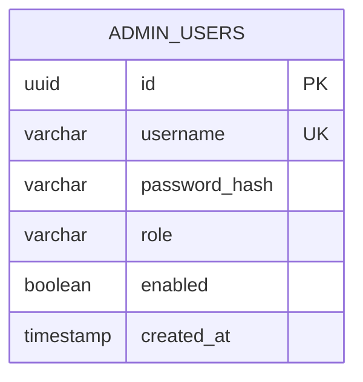

# DER — Autenticação

O esquema atual do `PosTech15SOAT-V2` possui uma entidade persistente específica para autenticação administrativa: `admin_users`. A tabela armazena somente o hash da senha, nunca a senha em texto puro.

## Regras identificadas

| Campo | Regra |
|---|---|
| `id` | Chave primária UUID |
| `username` | Obrigatório e único |
| `password_hash` | Obrigatório; representa credencial derivada, não senha em claro |
| `role` | Obrigatório; define autorização do usuário administrativo |
| `enabled` | Obrigatório, padrão `true`; permite revogação lógica de acesso |
| `created_at` | Obrigatório, preenchido com `CURRENT_TIMESTAMP` |

## Relação com o domínio

No schema consolidado atual, `admin_users` não possui chave estrangeira para `cliente` ou demais entidades de negócio. Isso caracteriza a autenticação administrativa como um contexto separado do cadastro de clientes. Essa separação reduz acoplamento entre identidade administrativa e entidades de domínio.

## Evoluções recomendadas

1. Manter algoritmos de hash adaptativos (por exemplo BCrypt/Argon2) na aplicação.
2. Não persistir tokens JWT na tabela de usuários; tokens devem permanecer stateless ou possuir armazenamento dedicado de revogação quando necessário.
3. Criar tabelas de refresh token/sessão apenas se o requisito funcional exigir revogação ou múltiplas sessões.
4. Avaliar RBAC normalizado (`roles`, `permissions`) somente se houver crescimento real da matriz de autorização; para o escopo atual, o atributo `role` é suficiente.
