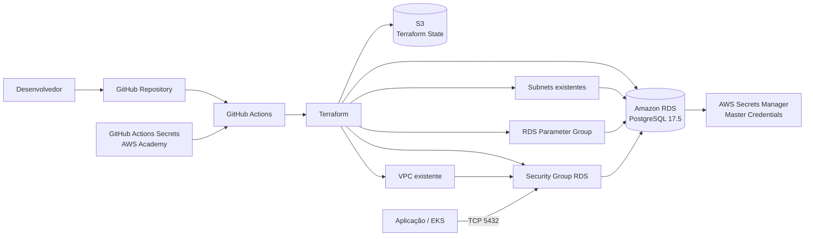

# Diagrama de Componentes

# Diagrama de Componentes

## Responsabilidades

- **PosTech15SOAT-Infra-Banco**: ciclo de vida do RDS, Parameter Group, Security Group e integração com Secrets Manager.
- **Infraestrutura principal**: VPC e subnets privadas consumidas por remote state.
- **GitHub Actions**: validação, plano e aplicação controlada do Terraform.
- **AWS Secrets Manager**: armazenamento das credenciais master gerenciadas pelo próprio RDS.
