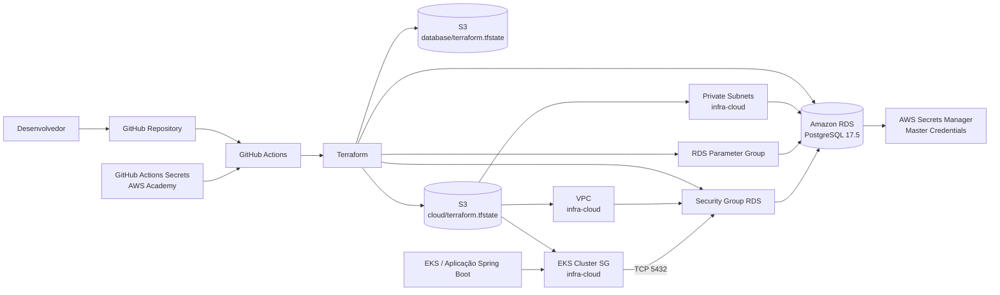

# Diagrama de Componentes

## Responsabilidades

- **postech15soat-infra-database**: ciclo de vida do RDS, DB Subnet Group, Parameter Group, Security Group, state do banco e integração com Secrets Manager.
- **postech15soat-infra-cloud**: VPC, subnets privadas e Security Group do EKS publicados via remote state.
- **GitHub Actions**: validação, plano e aplicação controlada do Terraform.
- **AWS Secrets Manager**: armazenamento das credenciais master gerenciadas pelo próprio RDS.
